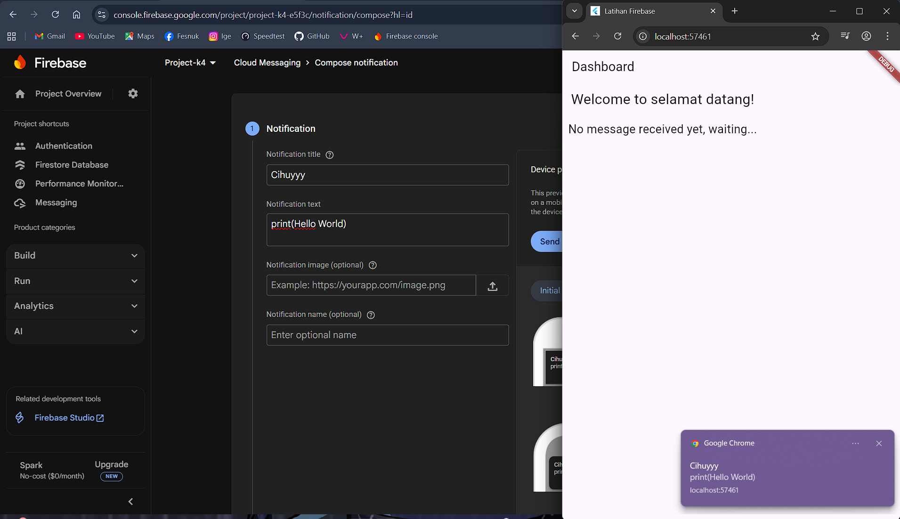
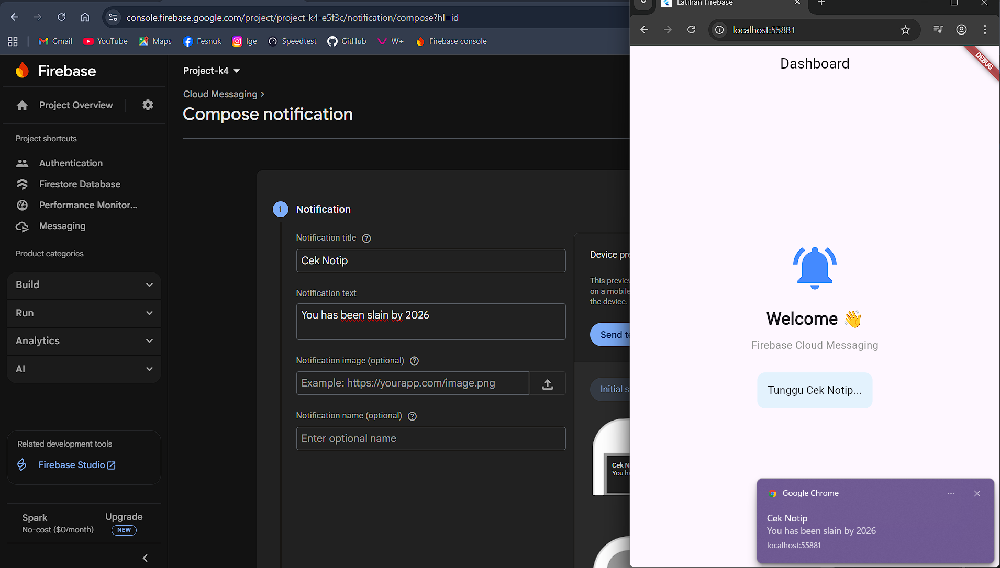
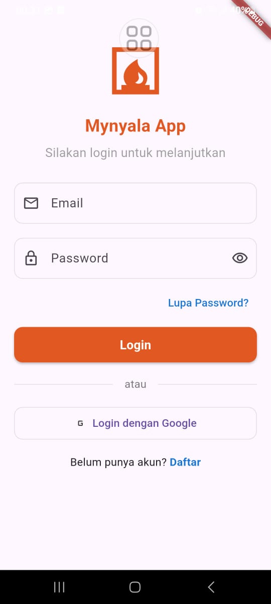
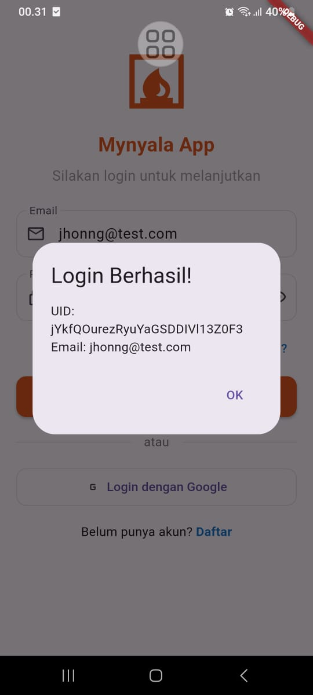
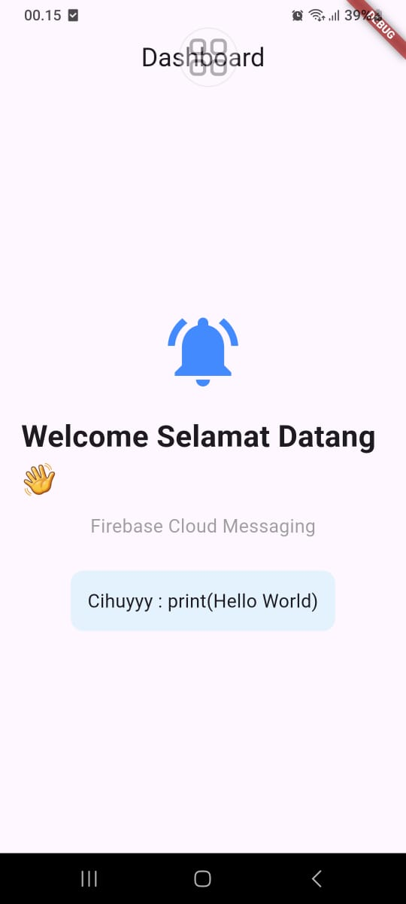
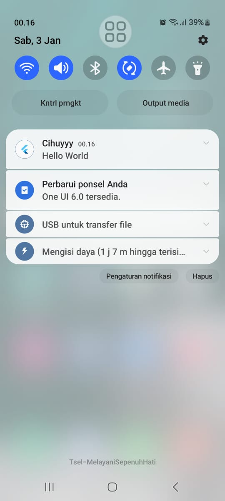

# Latihan Firebase & Flutter Integration 🚀

Project ini merupakan hasil pengerjaan **Tugas Week 10** pada mata kuliah **Pemrograman Mobile**.  
Aplikasi dikembangkan menggunakan **Flutter** dan terintegrasi dengan **Firebase** sebagai backend, meliputi **Firebase Authentication** dan **Firebase Cloud Messaging (FCM)**.

Aplikasi memiliki alur:
**Splash Screen → Login → Dashboard**, dengan tampilan UI modern dan fungsional.

---

## 📱 Fitur Utama

1. **Splash Screen**  
   Menampilkan intro aplikasi sebelum masuk ke halaman login.

2. **Login Page UI**  
   Tampilan login modern dengan validasi input email dan password.

3. **Firebase Authentication**  
   Autentikasi user menggunakan Email dan Password melalui Firebase Auth.

4. **Dashboard Page**  
   Halaman utama setelah login yang menampilkan informasi dan pesan notifikasi.

5. **Firebase Cloud Messaging (FCM)**  
   Implementasi push notification menggunakan Firebase Cloud Messaging:
   - Generate **FCM Token** per device
   - Menerima notifikasi saat aplikasi **foreground**
   - Menerima notifikasi saat aplikasi **background**

6. **Error Handling & Loading State**  
   Menampilkan pesan error saat login gagal serta indikator loading saat proses autentikasi.

---

## 🛠️ Tech Stack & Tools

- **Flutter SDK** — Framework UI utama
- **Firebase Authentication** — Autentikasi user
- **Firebase Cloud Messaging (FCM)** — Push notification
- **Postman** — Pengujian pengiriman notifikasi individu
- **VS Code** — Code Editor
- **Android Device** — Media pengujian aplikasi

---

## 📝 Langkah Integrasi (Ringkas)

### 1. Setup Firebase Console
- Membuat project Firebase
- Mengaktifkan **Authentication (Email/Password)**
- Mengaktifkan **Firebase Cloud Messaging**
- Menghubungkan Flutter dengan Firebase menggunakan `flutterfire configure`

### 2. Konfigurasi Flutter
- Menambahkan dependency:
  - `firebase_core`
  - `firebase_auth`
  - `firebase_messaging`
- Inisialisasi Firebase di `main.dart`

### 3. Implementasi Firebase Authentication
- Login menggunakan `signInWithEmailAndPassword`
- Menangani error login dan loading state

### 4. Implementasi Firebase Cloud Messaging (FCM)
- Meminta izin notifikasi (Android 13+)
- Mengambil **FCM Token** pada halaman Dashboard
- Menangani notifikasi:
  - Foreground menggunakan `FirebaseMessaging.onMessage`
  - Background melalui sistem notifikasi Android

### 5. Pengujian Notifikasi
- Mengirim notifikasi menggunakan **Firebase Console (Test on device)**
- Pengujian pengiriman notifikasi ke device tertentu menggunakan **Postman**

---

## 📸 Screenshot Aplikasi

  
  
  
  
  
  

---

## ✅ Kesimpulan

Aplikasi berhasil mengintegrasikan Flutter dengan Firebase Authentication dan Firebase Cloud Messaging.  
Sistem login dan notifikasi berjalan dengan baik serta dapat dijadikan contoh implementasi Firebase pada aplikasi Flutter Android.

---

**NIM** 1123150070  
**Created by:** Satria Herlambang